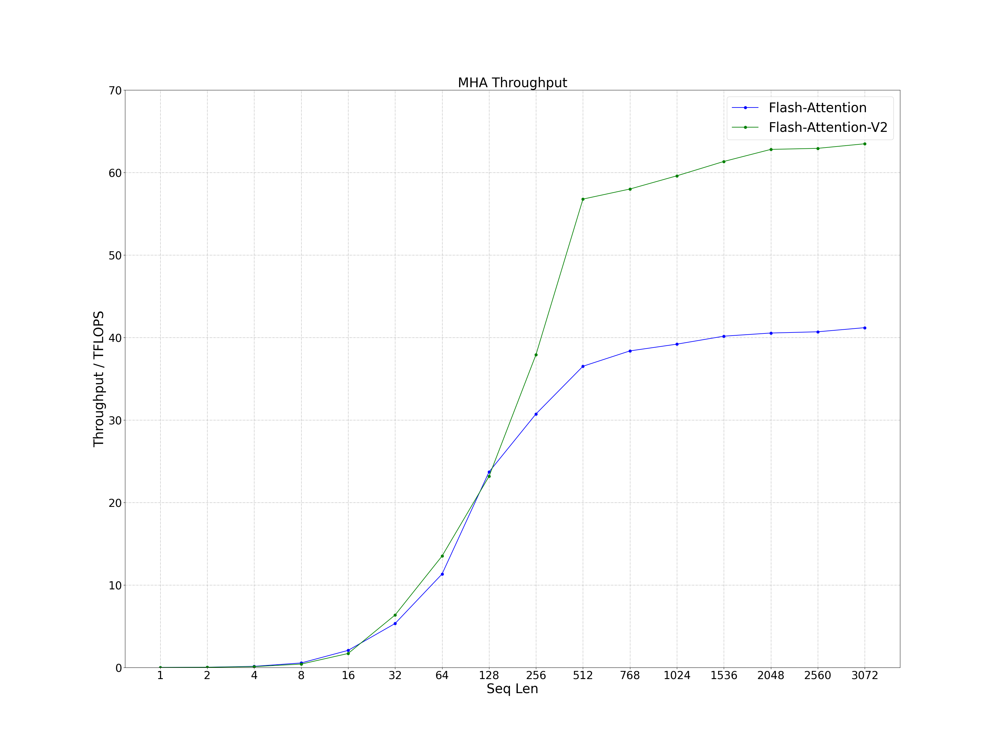
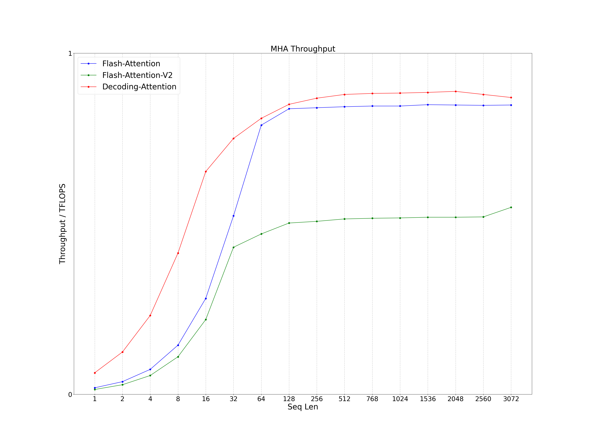
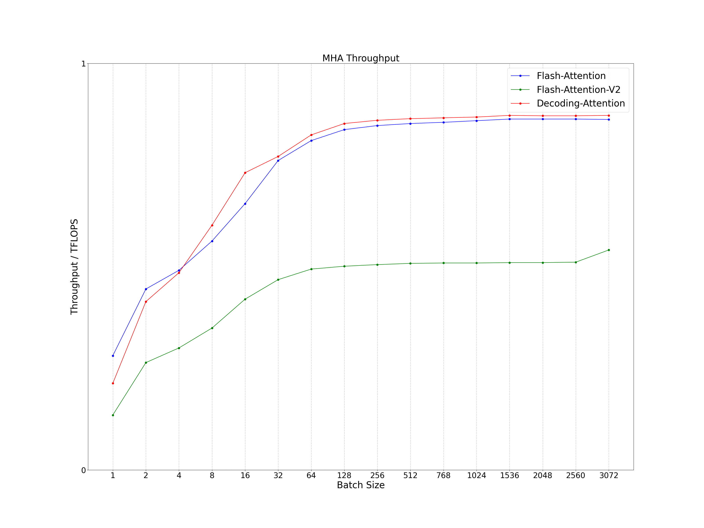
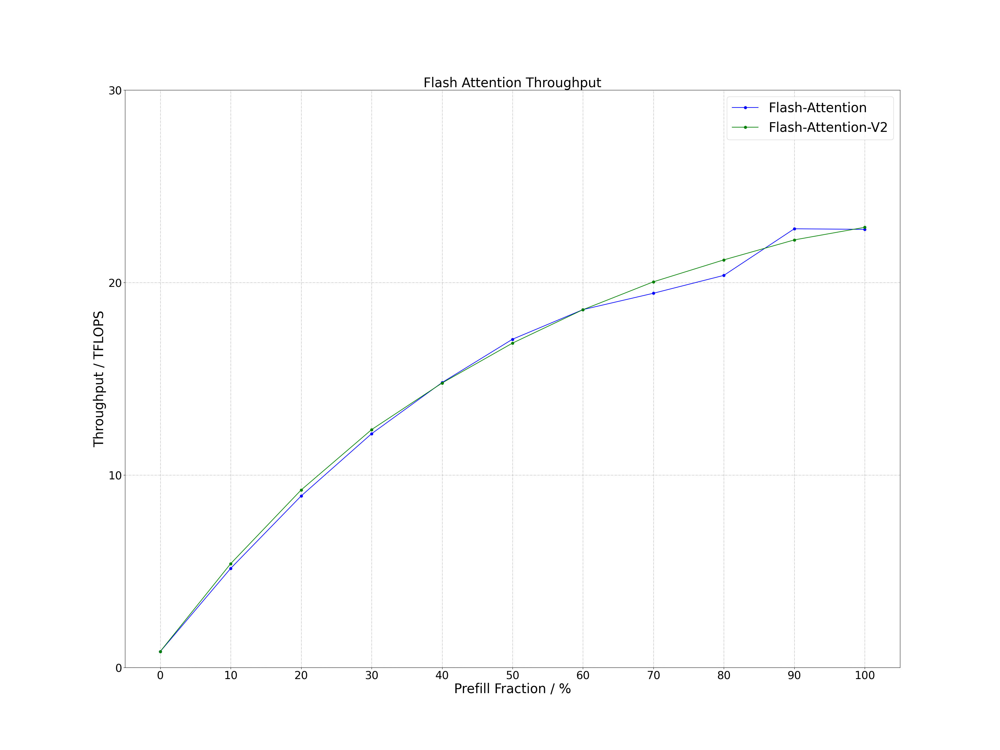

# Flash Attention Inference
Performance of the C++ interface of flash attention and flash attention v2 in large language model (LLM) inference scenarios. The calculation expression is as follows, where the precision of tensor Q, K, V and O is FP16. Remove redundant code from flash attention that has nothing to do with inference, such as backward, dropout, bf16 and torch dependencies, so you can easily integrate flash attention into LLM inference programs. In addition, Flash Attention and Flash Attention v2 have been modified to support Group Query Attention (GQA) / Multi Query Attention (MQA), Hybrid by Prefill and Decoding and Attention with Linear Biases (ALiBi) inference scenarios.
```
O = Softmax(Q * K^T) * V
```


In order to solve the problem of low Tensor Core utilization of Flash Attention in the decoding stage of LLM inference, refer to OpenPPL and Flash Attention, and use the handwritten Decoding Attention operator of CUDA Core for optimization. The calculation expression is as follows, where the precision of tensor Q, K, V and O is FP16. In most LLM inference decoding scenarios, the performance of Decoding Attention is better than Flash Attention and Flash Attention v2. In addition, Decoding Attention also supports GQA / MQA and ALiBi inference scenarios.

The kv cache is quantized by int8 using per head method, which can save half of the GPU memory and reduce the cost of inference.


# Support
- GQA/MQA Inference: Group Query Attention / Multi Query Attention Inference
- Hybrid Inference: Hybrid Inference by Prefill and Decoding
- ALiBi Inference: Attention with Linear Biases
- Decoding Attention: Self Multi Head Attention of Decoding Stage with CUDA Core
- Decoding Attention Int8: Self Multi Head Attention of Decoding Stage with CUDA Core, and KV Cache is Quantized by Int8 Using per Head Method

# Compile
## Environment
- OS: Linux
- Cmake Version: >= 3.12
- GCC Version: >= 5
- CUDA Version: >= 11.4
- Gflags: install on ubuntu as follows
```
sudo apt-get install libgflags-dev
```

## Clone
```
git clone https://github.com/Bruce-Lee-LY/flash_attention_inference.git
```

## Build
### NVIDIA A100
```
cd flash_attention_inference
./build.sh -a 80 -t Release -b OFF
./build.sh -a 80 -t Debug -b OFF
```

### RTX3080Ti / RTX3090 / RTX A6000
```
cd flash_attention_inference
./build.sh -a 86 -t Release -b OFF
./build.sh -a 86 -t Debug -b OFF
```

# Run Sample
```
./run_sample.sh
```

# Performance
Process the data in the log and plot it as a line chart.

```
cd tools/performance
./performance.sh
```

## RTX3090
- CUDA Version: 11.8
- Head Num: 32
- Head Dim: 128

### Prefill
#### Seq Len
The performance of both is similar for short sequences and Flash Attention v2 performs well in long sequences. It can increase by about 50%.
- Batch Size: 128
- Seq Q: Seq Len
- Seq K: Seq Len



#### Batch Size
When the batch size is small, the Flash Attention v2 performance is better. When the batch size is large, the performance of the two kernels is comparable.
- Batch Size: Batch Size
- Seq Q: 128
- Seq K: 128


### Decoding
#### Seq Len
The performance of both is similar for short sequences and Flash Attention performs well in long sequences. Regardless of the size of seq len, Decoding Attention performance is better than Flash Attention and Flash Attention v2.
- Batch Size: 128
- Seq Q: 1
- Seq K: Seq Len



#### Batch Size
The Flash Attention performance is better regardless of batch size. When the batch size is less than 4, the Decoding Attention performance is between Flash Attention and Flash Attention v2, when the batch size is greater than 4, the Decoding Attention performance is better than Flash Attention and Flash Attention v2.
- Batch Size: Batch Size
- Seq Q: 1
- Seq K: 128



### Hybrid
Regardless of the ratio of Prefill to Decoding, Flash Attention and Flash Attention v2 are similar in performance.
- Batch Size: 100
- Seq Q: 128
- Seq K: 128



# Reference
## [flash-attention](https://github.com/Dao-AILab/flash-attention)
- flash attention: v1.0.9
- flash attention v2: v2.1.0

## [cutlass](https://github.com/NVIDIA/cutlass)
- cutlass: v3.1.0
